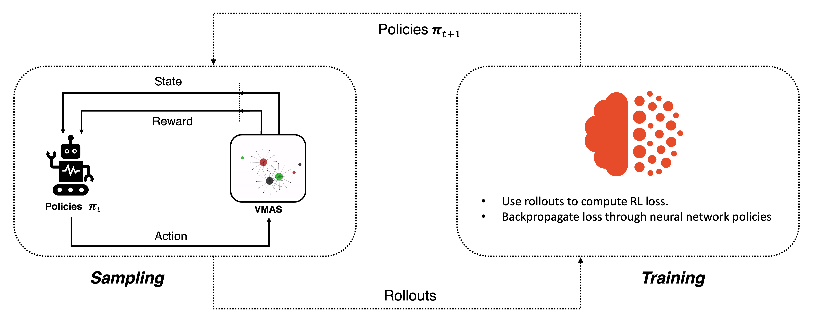
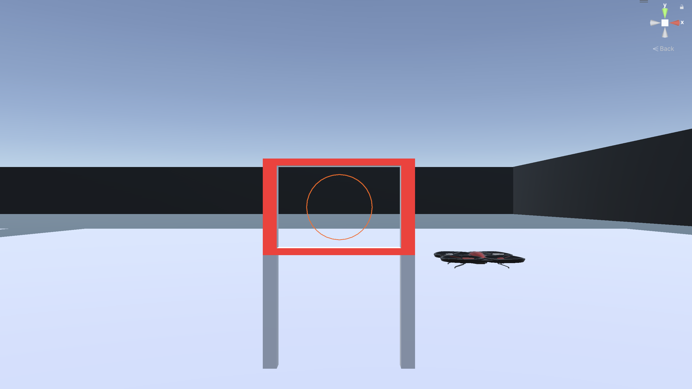
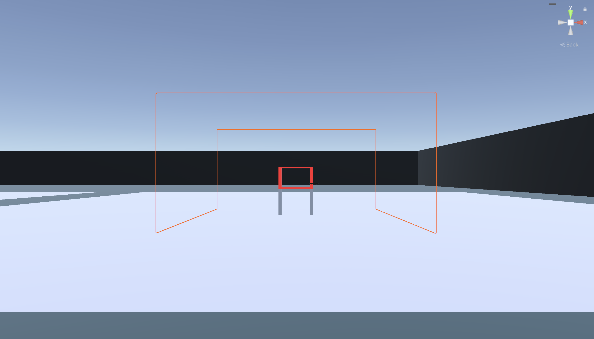

# Drone Navigation with Reinforcement Learning


## Table of Contents
- [Drone Navigation with Reinforcement Learning](#drone-navigation-with-reinforcement-learning)
  - [Table of Contents](#table-of-contents)
  - [Overview](#overview)
  - [Key Features](#key-features)
  - [Why Reinforcement Learning?](#why-reinforcement-learning)
  - [Reward Function Breakdown](#reward-function-breakdown)
    - [Distance-Based Reward](#distance-based-reward)
    - [Alignment Reward (Yaw \& Pitch)](#alignment-reward-yaw--pitch)
    - [Collision Handling](#collision-handling)
    - [Proximity Penalty (Boundary Avoidance)](#proximity-penalty-boundary-avoidance)
    - [Smooth Control Reward](#smooth-control-reward)
  - [Installation \& Setup](#installation--setup)
    - [1️⃣ Install Unity \& ML-Agents](#1️⃣-install-unity--ml-agents)
    - [2️⃣ Build Simulation and Replace the Agent Script in Unity](#2️⃣-build-simulation-and-replace-the-agent-script-in-unity)
    - [3️⃣ Setting Up](#3️⃣-setting-up)
  - [Project Structure](#project-structure)
  - [Usages](#usages)
    - [1️⃣ Train the Agent](#1️⃣-train-the-agent)
    - [2️⃣ Load \& Test the Model](#2️⃣-load--test-the-model)
  - [Contributing](#contributing)
    - [Steps to Contribute:](#steps-to-contribute)
  - [License](#license)

---

## Overview

This project leverages **Unity ML-Agents** and **Stable Baselines3** to train a **Drone agent** to autonomously navigate through a gate while avoiding obstacles. By employing **Proximal Policy Optimization (PPO)**, a reinforcement learning algorithm, the drone learns to optimize its flight path, achieving efficient and smooth navigation. This project showcases the power of RL in solving complex navigation tasks in simulated environments.

---

## Key Features

-   **Deep Reinforcement Learning (RL):** Utilizes Unity ML-Agents for environment interaction and Stable Baselines3 for training.
-   **Custom Reward System:** Incentivizes optimal flight behavior through a meticulously designed reward function.
-   **RGB Camera Sensors:** for CNN Network.
-   **Smooth Control:** Promotes gradual and natural drone movements.
-   **Training & Evaluation:** Supports both training from scratch and loading pre-trained models.

---

## Why Reinforcement Learning?

Reinforcement learning provides a powerful framework for teaching agents to perform complex tasks through trial and error. By interacting with the environment and receiving feedback in the form of rewards, the drone learns to optimize its actions to achieve the desired goal.



---

## Reward Function Breakdown

The reward function is crucial for guiding the drone's learning process. It provides feedback on the drone's performance, encouraging desirable behaviors and discouraging undesirable ones.

### Distance-Based Reward

-   **Goal:** Encourage the drone to move towards the gate.
-   **Mechanism:** Provides a positive reward for decreasing the distance to the gate and a negative reward for increasing it.
-   **Implementation:** Uses exponential decay to prioritize efficiency.

    ```csharp
    float reward = Mathf.Exp(-Mathf.Abs(currentDistance - previousDistance));
    ```

### Alignment Reward (Yaw & Pitch)

-   **Goal:** Ensure the drone is correctly aligned with the gate.
-   **Mechanism:** Rewards the drone for reducing the difference between its current yaw and pitch and the target alignment.

    ```csharp
    float yawChange = Mathf.Abs(currentYaw - targetYaw);
    float pitchChange = Mathf.Abs(currentPitch - targetPitch);
    reward -= (yawChange + pitchChange) * alignmentPenaltyFactor;
    ```

### Collision Handling

-   **Goal:** collisions GateGoal for sure passing from Gate.

    #### Successful Gate Passage

    -   **Reward:** +50 for successfully passing through the gate.
      

    #### Boundary Definition

    -   **Penalty:** -50 for hitting an obstacle, -25 for colliding with the gate frame.
    -   **Episode Termination:** Ends the episode on any collision.
      

    ```csharp
    void OnCollisionEnter(Collision collision) {
        if (collision.gameObject.CompareTag("Target")) {
            AddReward(50f);
            EndEpisode();
        } else {
            AddReward(-50f);
            EndEpisode();
        }
    }
    ```

### Proximity Penalty (Boundary Avoidance)

-   **Goal:** Encourage the drone to maintain a safe distance from Boundary.
-   **Mechanism:** Applies a negative reward for getting too close to Boundary, detected via raycasting.

    ```csharp
    if (Physics.Raycast(transform.position, direction, out hit, maxDistance)) {
        AddReward(-1f);
    }
    ```

### Smooth Control Reward

-   **Goal:** Promote smooth and natural drone movements.
-   **Mechanism:** Penalizes abrupt changes in control actions.

    ```csharp
    float actionChange = Mathf.Abs(currentAction - previousAction);
    reward -= actionChange / 5f;
    ```
---

## Installation & Setup

### 1️⃣ Install Unity & ML-Agents

1. **Download and install Unity** (Recommended version: `2022.3.12f1` or later).
2. Ensure the necessary packages are included:
   - **ML-Agents** (`ml-agents`)
   - **Input System** (`com.unity.inputsystem`)

### 2️⃣ Build Simulation and Replace the Agent Script in Unity

Check out this repository for the simulation: 🔗 [Quadrotor Simulation](https://github.com/Oneiben/quadrotor-simulation-unity.git)

To ensure proper training and control of the drone agent:  

1. **Replace the script** `Drone_Agent.cs` inside your Unity project:  
   **Path:** `Assets/Drone_Agent/Scripts/Agent/Drone_Agent.cs`

2. Navigate to `TrainScene > Drone` in the **Inspector** section:
   - Adjust **Control Properties** & **Speed Settings** for movement customization.  
   - Configure the **Sensors** (Cameras) based on your desired observation space.  

3. Build & run the Unity environment to validate the agent’s behavior.
4. Ensure the Unity build path is correctly set in your training script.

---

### 3️⃣ Setting Up

Follow these steps to set up the project:

1. **Clone the Repository:**

   ```bash
   git clone https://github.com/Oneiben/drone-rl-navigation.git
   cd drone-rl-navigation
   ```

2. **Install Dependencies:**
   Make sure you have Python 3.10.12 installed, then install the required packages using:
   ```bash
   pip install -r requirements.txt
   ```

---

## Project Structure

```plaintext
drone-rl-navigation/
├── media/                      # Images & GIFs
├── src/                        # Core project code
│   ├── agent/                  # RL agent script
│   │   ├── Drone_Agent.cs      
│   │
│   ├── evaluation/             # Testing & model evaluation
│   │   ├── test.py             
│   │
│   ├── training/               # Training-related scripts
│   │   ├── train.py            
│   │   ├── SuccessCallback.py  
│   │
├── LICENSE
├── README.md
└── requirements.txt
```
---

## Usages

### 1️⃣ Train the Agent
  Run the following command to start training:  
  ```shell
  python ./src/main.py
  ```

### 2️⃣ Load & Test the Model
for testing trained model:

```shell
python ./src/test.py
```
---
## Contributing

Contributions are welcome! If you have suggestions or improvements, feel free to fork the repository and create a pull request.

### Steps to Contribute:

1. Fork the repository.
2. Create a new branch:
   ```bash
   git checkout -b feature-name
   ```
3. Commit your changes:
   ```bash
   git commit -m "Description of changes"
   ```
4. Push the changes and open a pull request.

---

## License

This project is licensed under the MIT License. See the [📜 LICENSE](LICENSE) file for more details.
